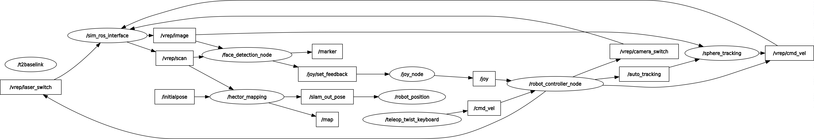
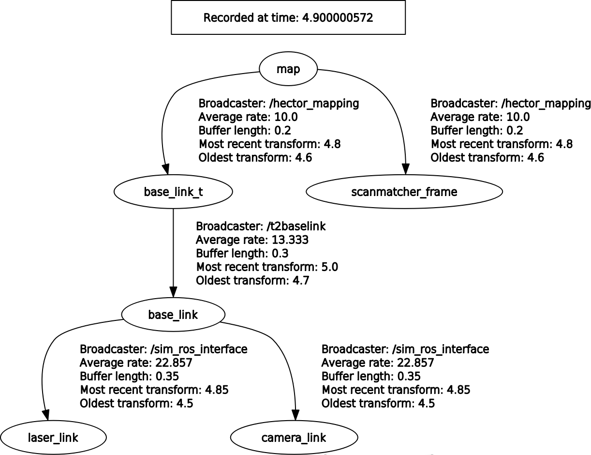
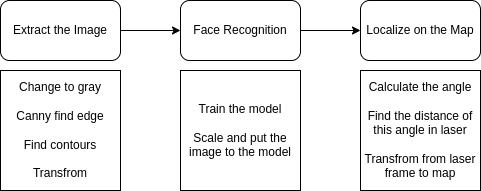
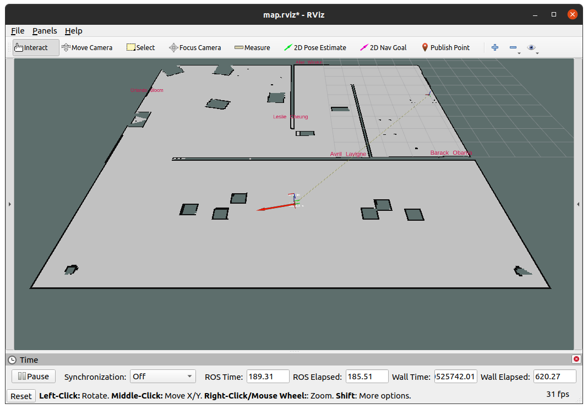
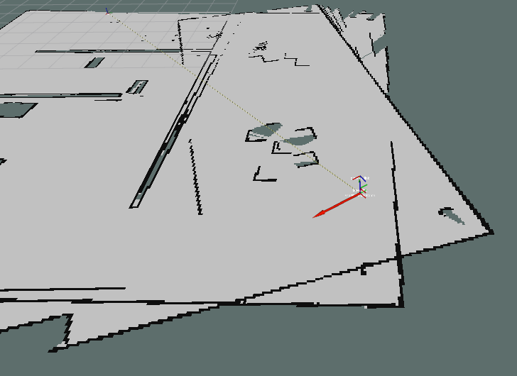
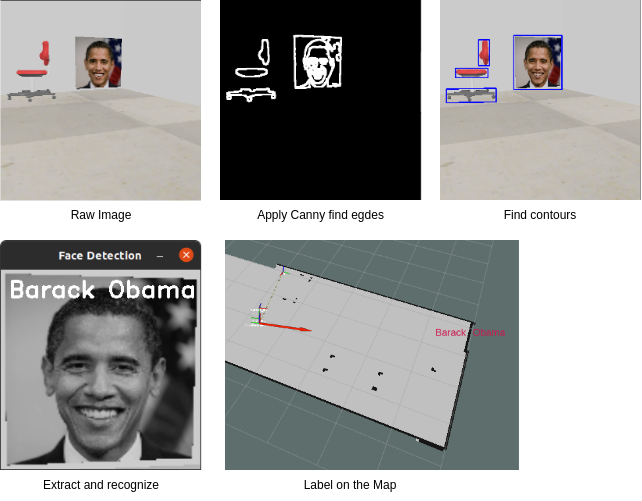
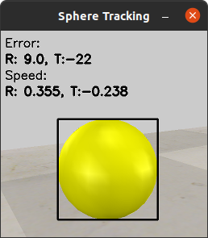

# ELEC3210 Project Report
#### Dec 8, 2022
#### A demo video is available [here](https://youtu.be/kpoI3TCokHw).  
### Jiekai ZHANG jzhanger@connect.ust.hk
### Yutian ZHANG yzhangkq@connect.ust.hk

## 1. Introduction
### 1.1 Overview
The project is to control the Pioneer3-DX robot in V-Rep using ROS. The robot is equipped with a camera, a laser scanner. The tasks are as follows:
- Control the Pioneer3-DX robot in V-Rep using keyboard and joy-con
- Bulid a 2D map of the indoor environment
- Detect, recognize and locate the images on the wall
- Localization of the robot in the map
- Follow the yellow sphere in the environment
- A bring-up of the robot by launch file  

All the tasks will be descriped in detail in the [implementation section](#3-implementation).   

### 1.2 Work Division
The following table shows the work division of the project.
| Task         | Person                   | Package | Node |
| ------------ | ----------------------- | ---- | ---- |
| Control the robot | Jiekai ZHANG | robot_controller | robot_controller_node |
| Bulid map | Jiekai ZHANG | robot_map (robot_nav) | hector_mapping |
| Face Recognition | Jiekai ZHANG | face_detection, utils | face_detection_node, face_train |
| Localization | Yutian ZHANG | robot_position | robot_position |
| Follow the sphere | Yutian ZHANG | sphere_tracking | sphere_tracking |
| All-in-one launch | Jiekai ZHANG | robot_bringup | NULL |

## 2. Environment Setup
### 2.1 Software
The following list shows the software version used in the project.
- Ubuntu 20.04 (Kernal Version 5.15.0-56-generic)
- ROS Noetic
- CoppeliaSim 4.4.0
- Python 3.8.10
- OpenCV 4.2.0

### 2.2 Ros Packages
The following list shows the external ros packages used in the project. Here, I assume you have installed desktop version of ROS Noetic. (There are some necessary tools like ```tf```, ```rqt``` and ```rviz``` in the desktop version).  
- **joy** (```sudo apt-get install ros-noetic-joy```) 
this package can read the input from the joy-con and also send the force feedback (let it vibrate) to the joy-con.
- **teleop_twist_keyboard** (```sudo apt-get install ros-noetic-teleop-twist-keyboard```) 
this package can control the robot using keyboard, but there's a lot problems, more detial on section [3.x](#3-implementation).
- **hector_mapping** (```sudo apt-get install ros-noetic-hector-slam```) 
this package can build a 2D map of the environment using **only** laser scan.
- **cv_bridge** (```sudo apt-get install ros-noetic-cv-bridge```) 
this package can convert the image from ROS to OpenCV and vice versa.
- **image_transport** (```sudo apt-get install ros-noetic-image-transport```) 
this package can publish and subscribe the image in ROS.
- If you want to try gmapping in ```robot_nav```, you need to install the following packages:
    - **gmapping** (```sudo apt-get install ros-noetic-slam-gmapping```) 
    this package can build a 2D map of the environment using **both** laser scan and odometry.
    - **robot_localization** (```sudo apt-get install ros-noetic-robot-localization```) 
    this package can fuse the odometry and control command to get the pose of the robot.  

### 2.3 Simulation Setup
First, please make sure the plugin ```ROS``` is already installed in your CoppeliaSim. If not, please install it by following the instructions in the [ROS tutorial](https://www.coppeliarobotics.com/helpFiles/en/ros1Tutorial.htm).   
Then, remember to add the following line to your ```.bashrc``` (or to other setup scripts if you are not using bash) file:   
```bash
PATH="/path/to/your/vrep:$PATH"
export COPPELIASIM_ROOT_DIR="/path/to/your/vrep"
```    
The last step is to modify the given ```env.ttt``` file since there are some errors. (The one used in the code is already modified)
- Rename ```ROSInterface``` to ```ROS``` in line 46 the script of the Pioneer3-DX robot   
- **If your yellow sphere is not moving**, please changed the ```endPos``` in the script of the moving ball's path, which is the third parameter of line 24 in the Path's script, the number should be about 1000. The reason is that if the distance is too long, the generated trajectory duration will exceeds its numerical limits. For more detial please refer to [this official doc](https://www.coppeliarobotics.com/helpFiles/en/regularApi/simRuckigStep.htm).   

## 3. Implementation
### 3.1 Project Structure
#### The node and topic tree is as follows: 
You can refer to the table in section [1.2](#12-work-division) for the package and node name.   
(all the tf message is hidden in the graph)    
    
#### The TF Tree is as follows:  
Note that, first, there's no ```odom``` frame, the hector mapping node will publish the tf between ```map``` and ```base_link_t```.   
**Second, there is a ```base_link_t``` frame before the ```base_link```, which is the frame of the robot in the simulation and the ```base_link``` frame is not the same as the one in the simulation. If there's no ```base_link_t``` frame, the front of the slam pose is different from the front of the robot in the simulation.** The tf relation of the two frame, which is rotating 90 degree in yaw direction, is published by a static node in ```robot_map``` package.   
   

### 3.2 Keyboard and Joy-con Control (Jiekai ZHANG)
This feature is finished in the ```robot_controller``` package.   
For the keyboard control, the node ```robot_controller_node``` subscribes the ```/cmd_vel``` topic published by ```teleop_twist_keyboard```. Then the node will scale the speed command and send it to the robot on ```/vrep/cmd_vel```. This part is very simple, since the ```teleop_twist_keyboard``` node already did the job.   
For the joy control, the node ```robot_controller_node``` subscribes the ```/joy``` topic published by ```joy``` node. Then the node will extract the value from each joy and convert it to the speed command. The speed command will be sent to the robot on ```/vrep/cmd_vel```. Also, all the buttons are also being extracted to control the camera switch and laser switch. In addition, since the joystick is very sensitive, we need an additional detection that filters out very small movements. Below is the control logic of the XBox One joy-con.   
|  Item   | Function  |
|  ----  | ----  |
| Left Sticker  | Angular speed of the robot |
| Right Sticker  | Translational speed of the robot |
| Button A  | Switch bewteen keyboard and joy-con |
| Button B  | Switch on / off the laser |
| Button X  | Switch on / off the camera |
| Button Y  | Switch on / off the sphere tracking |   

### 3.3 Build Map (Jiekai ZHANG)
This feature is finished in the ```robot_map``` package.        
This part is all done by the ```hector_mapping``` node. The node subscribes the ```/vrep/scan``` topic and ```/tf``` topic. And it will publish the transform between ```map``` and ```base_link_t``` (The ```base_link_t``` frame is the frame of the robot in the simulation and the ```base_link``` frame is not the same as the one in the simulation.) and the map on ```/map``` topic.   
The node is very simple to use since it only require a laser scan and a tf tree. But most of the time the robot cannot move very fast otherwise the node cannot get enough information to build the map. That's why I first tried to use ```gmapping``` to bulid the map but unfortunately the odometry is not accurate enough. I will talk about this in the next section.   

### 3.4 Face Recognition (Jiekai ZHANG)
This feature is finished in the ```face_recognition``` package.    
This task is divided into three parts: image extraction, face recognition and image localization. The flow below shows the whole process.
    
First, the image extraction is to find the face image in the camera image and extract it. First, we convert the image in to gray scale, and apply the [Canny edge detection algorithm](https://docs.opencv.org/4.x/da/d22/tutorial_py_canny.html) to find the edges. Then we use the ```findContours``` function to find the contours of the edges, all the contours all selected by the area and the aspect ratio. After we get the best contour ```perspective_transform``` is applied to transfrom the rectangle to a 256*256 square. Now, the image is ready to be sent to the face recognition model.    
Second, the face recognition is to recognize the face in the image. The model is using [EigenFaceRecognizer](https://docs.opencv.org/4.x/dd/d7c/classcv_1_1face_1_1EigenFaceRecognizer.html) in OpenCV. The model is trained by the images in the ```face_detection/images``` folder and the model is located in ```face_detection/model``` folder and the training node is ```face_train```. The model will return the label of the image.   
The last part is to localize the face in the map. We first calculate the angle between the image and the camera using the face's x position in the image. And after getting the angle, I just use this laser scan data to find the distance between the robot and the image. Once we get the angle and the distance, we can calculate the position of the image in the map. The node ```face_recognition``` will publish a text maker with distance with respect to the ```laser_link``` to rviz and it will be shown on the map.   
And one interesting feature is once a face is detected, a joy-confeedback will be sent to the joy-con. And the joy-con will vibrate according to the confidence of the face, the higher the confidence is the stronger the vibration is.   

### 3.5 Room Localization (Yutian ZHANG)
This feature is finished in the ```robot_position``` package.   
This task is very easy. The position of the robot is given by the ```hector_mapping``` node. Although it is different from the absolute position given in the simulation, we just find the boundary by experiment. Below is out logic of judging the current room of the robot.   
```python
# Room D is only depend on the y position
if pos.pose.position.y > BORDER_Y:
    room = 'D'
# From A to B to C there are two boundaries from left to right
elif pos.pose.position.x < BORDER_XAB:
    room = 'A'
elif pos.pose.position.x < BORDER_XBC:
    room = 'B'
else:
    room = 'C'
```   

### 3.6 Sphere Tracking (Yutian ZHANG)
This feature is finished in the ```sphere_tracking``` package.   
This task is divided into two parts: sphere detection and sphere tracking.   
First, the detection is to find the sphere in the camera image. We just apply a color filter to the image and find the contours of the sphere. And since there's no disruptions in the simulation environment, this filter will give us a perfect circle. Below is some important code:   
```python
# Convert the image to HSV
hsv_raw = cv2.cvtColor(raw, cv2.COLOR_BGR2HSV)
# Define the lower and upper boundaries of the color in the HSV color space
lower = np.array([22, 93, 0], dtype="uint8")
upper = np.array([45, 255, 255], dtype="uint8")
# Find the colors within the specified boundaries
mask = cv2.inRange(hsv_raw, lower, upper)
```      
After getting the circle, we use a rectangle to fit the circle. And we use the center of the rectangle as the center of the sphere. By calculating the distance between the center of the sphere and the center of the image, we can get the  angular error of the sphere, and by calculating the width of the rectangle, we can get the translational error of the sphere. Both error will go through a PID controller to get the angular speed and the translational speed of the robot. In addition, there is a offset (or feedfroward) in the translational speed since the sphere is moving at a constant speed of 0.2m/s.    
Another thing worth mentioning is that the we also add a acceleration limit to the translational speed, which means if the distance is too far, the robot will speed up slowly to prevent the robot from moving too fast. (If the robot speed up too fast there's high chance that the robot will not move in a stright line and then miss the sphere.)   
The contorl flow of tracking is shown below:   
  

### 3.7 All-in-One Launch (Jiekai ZHANG)
This feature is finished in the ```robot_bringup``` package.  
We just write a launch file to launch all the nodes we need. The launch file is located in ```robot_bringup/launch/launch.launch```. One thing worth mentioning is that most of the important parameters are located in this launch file, for example the PID of tracking and face detection threshold.  

## 4. Results and Conclusion
Most of the result is already shown in the [demo video](https://youtu.be/kpoI3TCokHw). Here I will just talk about some of the results that can be improved.  
### 4.1 Mapping
The following imge shows the map built by ```hector_mapping```. Since we are moving very slowly (about 1m/s) the map is quite well.  
   
But once we move faster, the map will be very bad, and sometime even cannot be built. This is the problem of ```hector_mapping``` since it is only using laser scan.   
To solve this I tried to calculate the odometry of the robot by using the control data. And use ```gmapping``` and ```robot_localization``` to do the SLAM. But the result is not good the major reason is that the robot is not moved as we commanded. The real speed is proportional to the control speed but they are not the same. (See the code below, it is from the Pioneer3-DX's script)    
```lua
-- set velocity
function velocity_callback(msg)
    sim.auxiliaryConsolePrint(console_debug,'linear: ' .. msg.linear.x)
    sim.auxiliaryConsolePrint(console_debug,' angular: ' .. msg.angular.z .. '\n')
    -- The following two lines are only make the robot's 
    -- speed proportional to the control speed, not the same
    vLeft = 6*msg.linear.x - 0.6*msg.angular.z
    vRight = 6*msg.linear.x + 0.6*msg.angular.z
    sim.setJointTargetVelocity(motorLeft,vLeft)
    sim.setJointTargetVelocity(motorRight,vRight)
end
```   

And another reason is that if we only input the odometry data to ```robot_localization``` the output pose is not accurate (even worse than directly integrate the Twist command).   
Below is a example of bad mapping:  
   
The laser scan was too slow relative to the angular velocity, causing the map to drift. With no odometry data available, it is difficult for us to compensate for this error once it occurs.   
So, in the future work, we can try to get a accurate odometry data and try to use ```gmapping``` to get a better data.  
### 4.2 Face Recognition
Below image shows the steps of face recognition.   
   
As we mentioned before, the image extract is very complex, which contains many steps. And sometimes the result is not very good, for example, the chair is detected, although it is not detected as a face but it still cost a lot of time, and sometimes it only extract some part of the image.    
To solve this, later, we can try to switch a face detection algorithm. I found one in OpenCV library which is [Cascade Classifier](https://docs.opencv.org/3.4/db/d28/tutorial_cascade_classifier.html) it can identify a face accurately and fast. (Note that it only identify a face, not recognize it.)   

### 4.3 Sphere Tracking
The following image is the result of sphere tracking.   
    
The error R indicate the number of pixels between the center of the sphere and the center of the image. And the error T indicate the width of the rectangle minus 300. And the error R and T will go through a PID controller to get the angular speed and the translational speed which is also shown in the image. But this is just simple following.  

[This video](https://drive.google.com/file/d/1ivm1pV4a1Geq1kKqgPonau2B9Q1nBhh1/view?usp=sharing) shows the result of sphere tracking in a long distance. And you can see that although we are very far away from the sphere, the robot can still track it very well. Here I will discuss how we achieve this.  
First is the PID for tracking. We use a PID controller to control the angular speed and the translational speed. And we also add a feedforward to the translational speed. The feedforward is the sphere's speed. After fine tuning the PID, the robot can track the sphere very well.  
But, only PID is not enough, when the sphere is far away, the PID will output a gaint speed, which will make the robot move very fast. So first, we add a acceleration limit to the translational speed, which means the robot will pick up speed slowly and this will prevents skidding and drifting. But just doing this will also limit the deacceleration speed, which means the robot will crash into the sphere. So we apply a different limit for deacceleration and it is much lager than the acceleration.  

### 4.4 Some Other Possible Future Work
- [ ] Use a better face detection algorithm like haar cascades.  
- [ ] Let the robot follow the wall to auto detect the environement.  
- [ ] Create a utility to help the user to set the parameters.  
- [ ] Follow the yellow Sphere in both directions (forward and backward).  

## 5. Reference
[ROS Tutorial](http://wiki.ros.org/ROS/Tutorials)  
[TF Tutorial](http://wiki.ros.org/tf/Tutorials)  
[ROS Navigation](http://wiki.ros.org/navigation)  
[Hector Mapping](http://wiki.ros.org/hector_mapping)  
[Joy](http://wiki.ros.org/joy)  
[VREP ROS Tutorial](https://www.coppeliarobotics.com/helpFiles/en/ros1Tutorial.htm)  
[simRuckigStep API](https://www.coppeliarobotics.com/helpFiles/en/regularApi/simRuckigStep.htm)  
[Face detection in OpenCV](https://docs.opencv.org/3.4/da/d60/tutorial_face_main.html)    
[Color filtering in OpenCV](https://docs.opencv.org/3.4/da/d97/tutorial_threshold_inRange.html)  
[Pioneer 3-DX Description](https://www.generationrobots.com/media/Pioneer3DX-P3DX-RevA.pdf)  